<div align="center">

# 👁️ Argus: Distributed Computer Vision Orchestrator
### Intelligent Edge-Cloud Video Analytics on Kubernetes


</div>

---

## 🚀 Overview

**Argus** is a production-grade, distributed MLOps platform designed to scale computer vision pipelines dynamically. Unlike traditional static scripts, Argus treats AI-powered cameras as **Kubernetes resources**, allowing for elastic scaling of inference workers based on real-world demand.

Built for resiliency and scale, Argus decouples the **Control Plane** (Manager) from the **Data Plane** (Workers), enabling it to manage hundreds of RTSP streams and batch video jobs simultaneously without bottlenecks.

> *"Argus isn't just an object detector; it's an operating system for visual intelligence."*

---

## 🏗️ Architecture: The Hybrid Edge-Cloud Pattern

Argus implements a **Manager-Worker** architecture pattern to ensure high availability and fault tolerance.

```mermaid
graph TD
    %% Styling
    classDef k8s fill:#326ce5,stroke:#fff,stroke-width:2px,color:#fff;
    classDef python fill:#3776ab,stroke:#fff,stroke-width:2px,color:#fff;
    classDef db fill:#47A248,stroke:#fff,stroke-width:2px,color:#fff;

    Client["🌐 Client (Web/Mobile)"] -->|REST API| Manager["🧠 Control Plane (Argus Manager)"]:::python
    
    subgraph Cluster ["☸️ Kubernetes Cluster"]
        direction TB
        Manager -->|K8s API| K8sCtrl["K8s Control Plane"]:::k8s
        
        K8sCtrl -->|Schedule| Worker1["🎥 Worker Pod: Live RTSP"]:::python
        K8sCtrl -->|Schedule| Worker2["🎞️ Worker Job: Batch Process"]:::python
        
        Worker1 -->|Inference| Model["YOLOv8 Engine"]
        Worker2 -->|Inference| Model
        
        Worker1 -.->|Metrics| Prom["📊 Prometheus (Metrics)"]
        Worker1 -->|Results| DB[("MongoDB (Metadata)")]:::db
        Worker2 -->|Results| DB
    end
```



### Key Components

1.  **Control Plane (k8s-automation-server)**:
    *   A **FastAPI** based orchestrator that speaks directly to the Kubernetes API.
    *   Translates high-level intent (e.g., "Monitor Camera X") into low-level K8s resources (Deployments, Services, CronJobs).
    *   Manages the lifecycle of inference pods, ensuring self-healing if a worker crashes.

2.  **Inference Engine (engine)**:
    *   **Low-Latency Stream**: Combines **GStreamer** with hardware-accelerated decoding (NVDEC/VAAPI) for real-time RTSP processing.
    *   **Universal Predictor**: A model-agnostic wrapper around **YOLOv8**, allowing for hot-swapping of models without rebuilding containers.
    *   **Smart Health Checks**: The engine self-monitors for "frozen frames", "signal loss", or "blurred images" and reports health status back to the control plane.

---

## 🌟 Key Technical Features

### 1. Dynamic Orchestration
Argus doesn't continuously burn GPU resources for idle streams. Resources are provisioned on-demand.
- **Live Streams**: Deployed as long-running `Deployments`.
- **Video Uploads**: Dispatched as ephemeral `CronJobs` that spin up, process data, and terminate to save costs.

### 2. The "Smart" Edge
*   **GStreamer Pipeline**: Hand-tuned pipeline with `appsink drop=true max-buffers=1` to ensure the AI always sees the *latest* frame, prioritizing latency over completeness.
*   **Safety Trackers**: Integrated logic to detect safety violations (e.g., entering restricted zones) using geometric algorithms (`shapely`).

### 3. Resilience & Observability
*   **Self-Healing**: If a camera stream dies, the worker pod automatically restarts the connection logic or signals the K8s manager to reschedule the pod.
*   **Decoupled Storage**: Video blobs are separated from metadata (MongoDB), ensuring the database remains lightweight and fast.

---

## 🛠️ Tech Stack

| Category | Technology | Usage |
| :--- | :--- | :--- |
| **Orchestration** | **Kubernetes**, Docker | Container management & scheduling |
| **Backend** | **Python**, FastAPI | REST API & Control logic |
| **AI/ML** | **YOLOv8** (Ultralytics) | Object Detection & Tracking |
| **Vision** | **OpenCV**, GStreamer | Video decoding & preprocessing |
| **Database** | **MongoDB** | Metadata & analytical results |
| **Infrastructure** | **Linux**, Bash | Base OS & scripting |

---

## 🏁 Getting Started

### Prerequisites
- Python 3.10+
- Docker
- A Kubernetes Cluster (Minikube, K3s, or EKS/GKE)
    - *Note: You can run the engine in "Standalone Mode" without K8s for testing.*

### 1. Run the Control Plane (Automation Server)
The brain of the operation. Handles API requests and manages the cluster.

```bash
cd k8s-automation-server
pip install -r requirements.txt
uvicorn app.main:app --reload
```
> Access Swagger Docs at: `http://localhost:8000/docs`

### 2. Run the Inference Engine (Standalone Mode)
For development, you can run the detector locally on your machine.

```bash
cd engine
pip install -r requirements.txt

# Run the standalone script
./run_standalone.sh
```

---

## 🗺️ Roadmap & MLOps

Future improvements to further enhance the MLOps maturity of Argus:
- [ ] **Model Registry**: Integrate **MLflow** for versioning model weights.
- [ ] **Observability Dashboard**: Export Prometheus metrics to **Grafana** for "Inference Latency" and "FPS" monitoring.
- [ ] **CI/CD**: GitHub Actions pipeline to auto-build and push Docker images on commit.

---

<div align="center">

**Built with ❤️ for Scalable AI**

</div>
